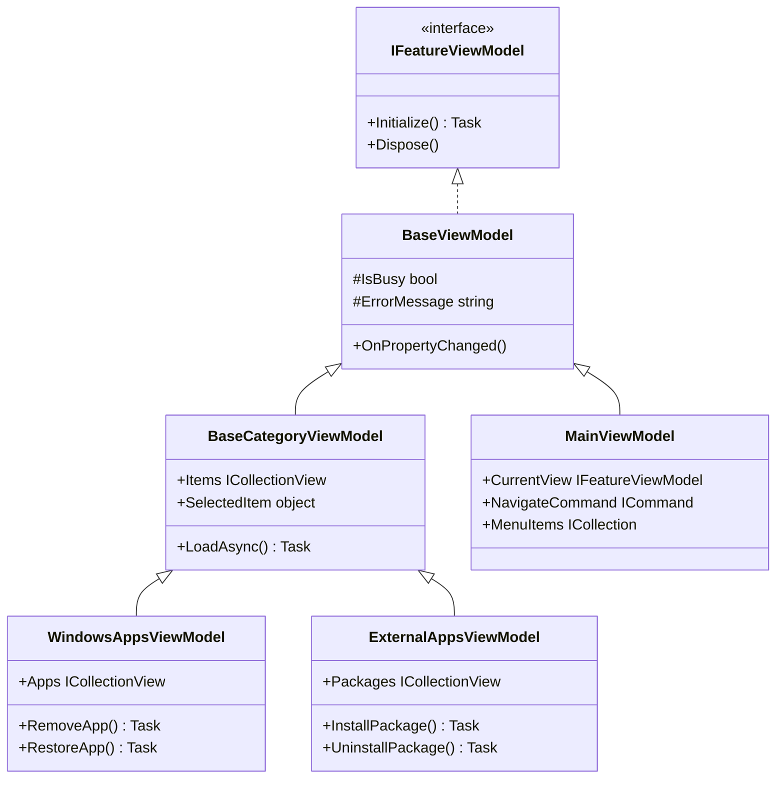
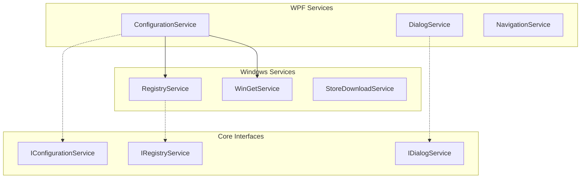
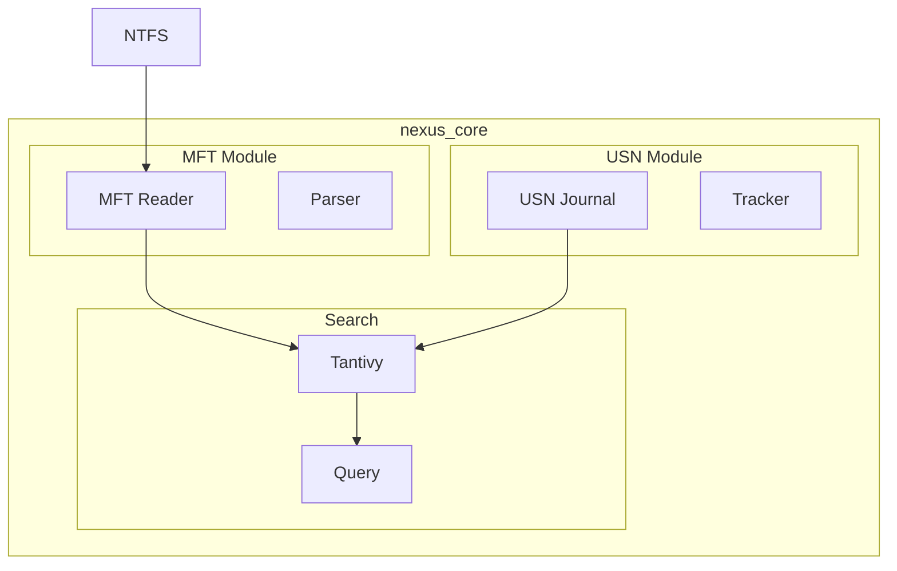
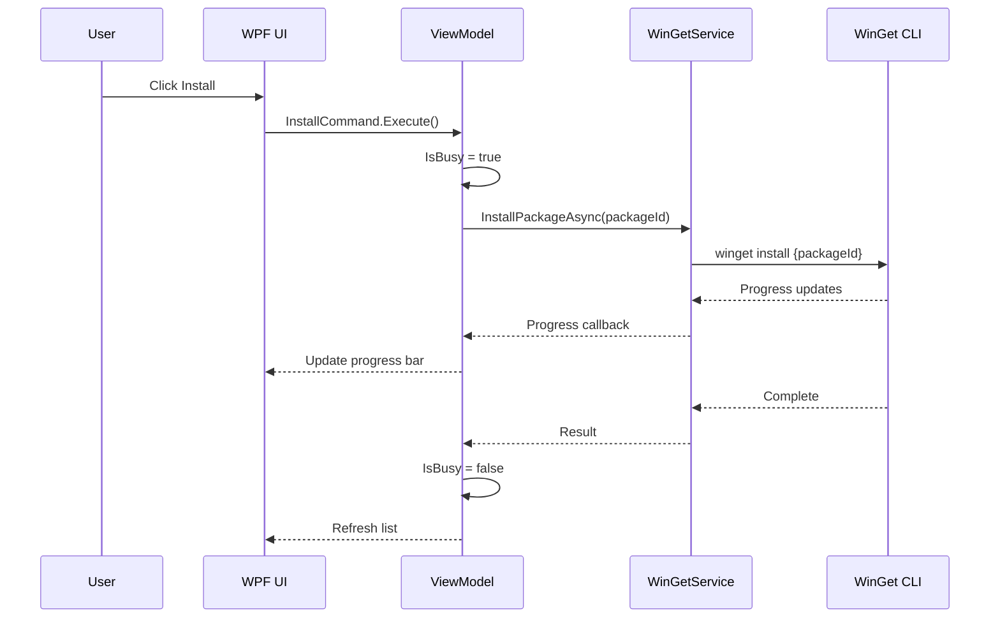
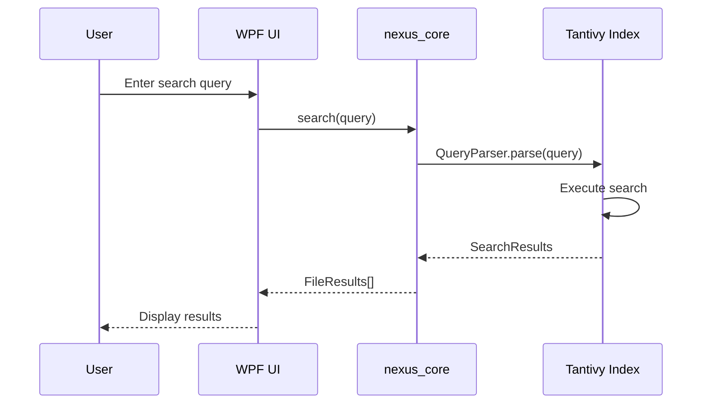

# 📐 Winhance-FS Technical Blueprints & Schematics

**Version:** 1.0
**Created:** January 23, 2026
**Purpose:** Detailed technical blueprints for Windsurf IDE developers

---

## 🏛️ System Architecture Blueprint

### Layer Overview

```
┌─────────────────────────────────────────────────────────────────┐
│                    🖥️ PRESENTATION LAYER                        │
│  ┌─────────────┐ ┌─────────────┐ ┌─────────────┐ ┌───────────┐ │
│  │   Views     │ │  ViewModels │ │  Converters │ │  Controls │ │
│  │  (XAML)     │ │  (C#/MVVM)  │ │  (IValue)   │ │  (Custom) │ │
│  └─────────────┘ └─────────────┘ └─────────────┘ └───────────┘ │
├─────────────────────────────────────────────────────────────────┤
│                    📦 APPLICATION LAYER                         │
│  ┌─────────────┐ ┌─────────────┐ ┌─────────────┐ ┌───────────┐ │
│  │  Services   │ │   Dialogs   │ │  Navigation │ │   Config  │ │
│  └─────────────┘ └─────────────┘ └─────────────┘ └───────────┘ │
├─────────────────────────────────────────────────────────────────┤
│                    📋 DOMAIN LAYER (Core)                       │
│  ┌─────────────┐ ┌─────────────┐ ┌─────────────┐ ┌───────────┐ │
│  │ Interfaces  │ │   Models    │ │    DTOs     │ │   Enums   │ │
│  └─────────────┘ └─────────────┘ └─────────────┘ └───────────┘ │
├─────────────────────────────────────────────────────────────────┤
│                  ⚙️ INFRASTRUCTURE LAYER                        │
│  ┌─────────────┐ ┌─────────────┐ ┌─────────────┐ ┌───────────┐ │
│  │  Registry   │ │   WinGet    │ │  Scheduled  │ │   Store   │ │
│  │  Service    │ │   Service   │ │    Tasks    │ │  Download │ │
│  └─────────────┘ └─────────────┘ └─────────────┘ └───────────┘ │
├─────────────────────────────────────────────────────────────────┤
│                   🦀 NATIVE LAYER (Rust)                        │
│  ┌─────────────┐ ┌─────────────┐ ┌─────────────┐ ┌───────────┐ │
│  │ MFT Reader  │ │ USN Journal │ │   Tantivy   │ │ FFI Bridge│ │
│  └─────────────┘ └─────────────┘ └─────────────┘ └───────────┘ │
├─────────────────────────────────────────────────────────────────┤
│                    🐍 AI LAYER (Python)                         │
│  ┌─────────────┐ ┌─────────────┐ ┌─────────────┐ ┌───────────┐ │
│  │ AI Agents   │ │  Classifier │ │  Analyzer   │ │MCP Server │ │
│  └─────────────┘ └─────────────┘ └─────────────┘ └───────────┘ │
└─────────────────────────────────────────────────────────────────┘
```

---

## 📊 Class Diagram - Core ViewModels



---

## 🔧 Service Layer Blueprint



---

## 🦀 Rust Nexus Core Schematic



---

## 📁 Directory Blueprint

```
src/
├── Winhance.Core/                    # Domain layer
│   ├── Features/
│   │   ├── Common/
│   │   │   ├── Interfaces/           # Service contracts
│   │   │   │   ├── IDialogService.cs
│   │   │   │   ├── IConfigurationService.cs
│   │   │   │   └── INavigationService.cs
│   │   │   └── Models/               # Domain models
│   │   │       ├── ConfigurationItem.cs
│   │   │       └── VerificationResult.cs
│   │   └── SoftwareApps/
│   │       ├── Interfaces/
│   │       └── Models/
│   └── Winhance.Core.csproj
│
├── Winhance.Infrastructure/          # Infrastructure layer
│   ├── Features/
│   │   ├── Common/
│   │   │   └── Services/
│   │   │       ├── RegistryService.cs
│   │   │       └── ScheduledTaskService.cs
│   │   └── SoftwareApps/
│   │       └── Services/
│   │           ├── WinGetService.cs
│   │           └── StoreDownloadService.cs
│   └── Winhance.Infrastructure.csproj
│
├── Winhance.WPF/                     # Presentation layer
│   ├── Features/
│   │   ├── Common/
│   │   │   ├── Services/
│   │   │   │   ├── ConfigurationService.cs    # 100 warnings
│   │   │   │   ├── DialogService.cs           # 20 warnings
│   │   │   │   └── UserPreferencesService.cs  # 28 warnings
│   │   │   ├── ViewModels/
│   │   │   │   ├── MainViewModel.cs
│   │   │   │   └── BaseCategoryViewModel.cs
│   │   │   └── Views/
│   │   └── SoftwareApps/
│   │       └── ViewModels/
│   │           ├── WindowsAppsViewModel.cs    # 60 warnings
│   │           └── ExternalAppsViewModel.cs   # 40 warnings
│   └── Winhance.WPF.csproj
│
└── nexus_core/                       # Rust native layer
    ├── src/
    │   ├── lib.rs
    │   ├── mft/
    │   ├── usn/
    │   └── search/
    └── Cargo.toml
```

---

## 🐍 Python AI Layer Blueprint

```
src/
├── nexus_ai/                         # AI Agents
│   ├── __init__.py
│   ├── agents/
│   │   ├── base_agent.py            # Base agent class
│   │   ├── file_agent.py            # File operations
│   │   └── analysis_agent.py        # Analysis operations
│   ├── classifiers/
│   │   └── file_classifier.py       # File type classification
│   └── analyzers/
│       └── space_analyzer.py        # Disk space analysis
│
├── nexus_mcp/                        # MCP Server
│   ├── __init__.py
│   ├── server.py                    # FastMCP server
│   └── tools/                       # MCP tool definitions
│       ├── file_tools.py
│       └── search_tools.py
│
└── nexus_cli/                        # CLI Tools
    ├── __init__.py
    └── main.py                      # CLI entry point
```

---

## 🔄 Sequence Diagram - App Installation



---

## 🔄 Sequence Diagram - File Search



---

## 🎨 MVVM Pattern Blueprint

```
┌─────────────────────────────────────────────────────────────┐
│                         VIEW (XAML)                         │
│  ┌───────────────────────────────────────────────────────┐ │
│  │  <DataGrid ItemsSource="{Binding Items}"/>            │ │
│  │  <Button Command="{Binding InstallCommand}"/>         │ │
│  └───────────────────────────────────────────────────────┘ │
│                            ↕                                │
│                      Data Binding                           │
│                            ↕                                │
├─────────────────────────────────────────────────────────────┤
│                     VIEWMODEL (C#)                          │
│  ┌───────────────────────────────────────────────────────┐ │
│  │  [ObservableProperty]                                 │ │
│  │  private ObservableCollection<Item> _items;           │ │
│  │                                                       │ │
│  │  [RelayCommand]                                       │ │
│  │  private async Task InstallAsync() { ... }            │ │
│  └───────────────────────────────────────────────────────┘ │
│                            ↕                                │
│                   Dependency Injection                      │
│                            ↕                                │
├─────────────────────────────────────────────────────────────┤
│                      MODEL/SERVICE                          │
│  ┌───────────────────────────────────────────────────────┐ │
│  │  public interface IWinGetService                      │ │
│  │  {                                                    │ │
│  │      Task<Result> InstallAsync(string packageId);     │ │
│  │  }                                                    │ │
│  └───────────────────────────────────────────────────────┘ │
└─────────────────────────────────────────────────────────────┘
```

---

## ⚠️ Warning Hotspots (Visual Blueprint)

```
Warning Density Map (by file, top 10):

ConfigurationService.cs      ████████████████████████████████████████  100
WindowsAppsViewModel.cs      ████████████████████████                   60
UnifiedConfigDialog...       ████████████████████                       52
ExternalAppsViewModel.cs     ████████████████                           40
FrameNavigationService.cs    ███████████████                            38
AutounattendXmlGenerator...  █████████████                              32
UserPreferencesService.cs    ███████████                                28
BaseSettingsFeatureVM.cs     ███████████                                28
WinGetService.cs             ███████████                                28
FeatureViewModelFactory.cs   ███████████                                28
```

---

## 🔧 Dependency Injection Blueprint

```csharp
// App.xaml.cs - Service Registration Pattern
services.AddSingleton<IConfigurationService, ConfigurationService>();
services.AddSingleton<IDialogService, DialogService>();
services.AddSingleton<INavigationService, FrameNavigationService>();
services.AddSingleton<IRegistryService, RegistryService>();
services.AddTransient<MainViewModel>();
services.AddTransient<WindowsAppsViewModel>();
services.AddTransient<ExternalAppsViewModel>();
```

---

## 📋 Key Files Quick Reference

| File                                     | Warnings | Primary Fix Needed            |
| ---------------------------------------- | -------- | ----------------------------- |
| `ConfigurationService.cs`                | 100      | Nullable returns, null checks |
| `WindowsAppsViewModel.cs`                | 60       | Field initialization          |
| `UnifiedConfigurationDialogViewModel.cs` | 52       | Property initialization       |
| `ExternalAppsViewModel.cs`               | 40       | Nullable types                |
| `FrameNavigationService.cs`              | 38       | Null reference returns        |

---

_This blueprint document provides technical schematics for Windsurf IDE._
_Last Updated: January 23, 2026_
