# 🌊 Winhance-FS Master Guide for Windsurf IDE

**Project:** Winhance-FS - Windows Storage Intelligence & File Forensics
**Version:** 0.1.0-alpha (in development)
**Created:** January 23, 2026
**Purpose:** Complete reference for Windsurf IDE to systematically fix and improve the codebase

---

## 📋 Table of Contents

1. [Project Overview](#project-overview)
2. [Architecture Diagrams](#architecture-diagrams)
3. [Project Structure](#project-structure)
4. [Technology Stack](#technology-stack)
5. [Current Issues & Fixes](#current-issues--fixes)
6. [Documentation Index](#documentation-index)
7. [Quick Commands](#quick-commands)

---

## 🎯 Project Overview

Winhance-FS is a **multi-language Windows desktop application** for storage intelligence and file forensics:

| Component                   | Language      | Purpose                                 |
| --------------------------- | ------------- | --------------------------------------- |
| **Winhance.WPF**            | C# (.NET 9.0) | Desktop GUI (MVVM pattern)              |
| **Winhance.Core**           | C# (.NET 9.0) | Interfaces, Models, Contracts           |
| **Winhance.Infrastructure** | C# (.NET 9.0) | Windows Services, Registry, File System |
| **nexus_core**              | Rust          | High-performance MFT reader, indexing   |
| **nexus_ai**                | Python        | AI agents, file classification          |
| **nexus_mcp**               | Python        | Model Context Protocol server           |
| **nexus_cli**               | Python        | Command-line tools                      |

---

## 🏗️ Architecture Diagrams

### System Architecture (Mermaid)

```mermaid
flowchart TB
    subgraph UI["🖥️ WPF Desktop Application (.NET 9.0)"]
        MainWindow["MainWindow.xaml"]
        ViewModels["ViewModels (MVVM)"]
        Views["Views & Controls"]
        Services["WPF Services"]
    end

    subgraph Core["📦 Winhance.Core"]
        Interfaces["Interfaces"]
        Models["Models & DTOs"]
        Constants["Constants & Enums"]
    end

    subgraph Infra["⚙️ Winhance.Infrastructure"]
        WinRegistry["Windows Registry Service"]
        WinServices["Windows Services"]
        FileServices["File System Services"]
        AppServices["App Management"]
    end

    subgraph Rust["🦀 Nexus Core (Rust)"]
        MFTReader["MFT Reader"]
        USNJournal["USN Journal"]
        TantivySearch["Tantivy Search Engine"]
        FFI["FFI Bridge"]
    end

    subgraph Python["🐍 Python AI Layer"]
        Agents["AI Agents"]
        SpaceAnalyzer["Space Analyzer"]
        FileClassifier["File Classifier"]
        SmartFileManager["Smart File Manager"]
    end

    subgraph MCP["🔌 MCP Server"]
        MCPServer["FastMCP Server"]
        Tools["MCP Tools"]
    end

    UI --> Core
    UI --> Infra
    Infra --> Core
    Infra --> Rust
    Python --> Rust
    MCP --> Python
```



### Data Flow Diagram


### CI/CD Pipeline

```mermaid
flowchart TD
    Push["🔀 Push to Main"] --> CI["GitHub Actions CI"]

    CI --> DotNet["🔷 .NET Build"]
    CI --> Rust["🦀 Rust Build"]
    CI --> Python["🐍 Python Check"]

    DotNet --> Complete["✅ CI Complete"]
    Rust --> Complete
    Python --> Complete

    Complete --> Release["🚀 Create Release"]
    Release --> Artifacts["📦 Build Artifacts"]
```



---

## 📁 Project Structure

```
Winhance-FS-Repo/
├── 📁 src/
│   ├── 📁 Winhance.Core/          # Core interfaces & models
│   ├── 📁 Winhance.Infrastructure/ # Windows services
│   ├── 📁 Winhance.WPF/           # Desktop application
│   ├── 📁 nexus_core/             # Rust high-performance engine
│   ├── 📁 nexus_ai/               # Python AI agents
│   ├── 📁 nexus_mcp/              # MCP server
│   ├── 📁 nexus_cli/              # CLI tools
│   └── 📄 Cargo.toml              # Rust workspace
├── 📁 tests/                      # Python tests
├── 📁 docs/                       # Documentation
├── 📁 .github/workflows/          # CI/CD
├── 📄 Winhance.sln                # .NET solution
└── 📄 pyproject.toml              # Python config
```

---

## 🛠️ Technology Stack

| Layer             | Technology              | Version  | Purpose                          |
| ----------------- | ----------------------- | -------- | -------------------------------- |
| **UI Framework**  | WPF                     | .NET 9.0 | Windows desktop GUI              |
| **MVVM Toolkit**  | CommunityToolkit.Mvvm   | Latest   | MVVM pattern implementation      |
| **DI Container**  | Microsoft.Extensions.DI | 9.0      | Dependency injection             |
| **Rust Runtime**  | Rust                    | 1.75+    | High-performance file operations |
| **Search Engine** | Tantivy                 | 0.21+    | Full-text search indexing        |
| **Python**        | Python                  | 3.11+    | AI agents and automation         |
| **MCP**           | FastMCP                 | Latest   | Model Context Protocol server    |
| **Linting**       | Trunk                   | Latest   | Multi-language linting           |

---

## 🔴 Current Issues & Fixes

### Priority Matrix

| Priority  | Category                             | Count   | Status          | Document                                                       |
| --------- | ------------------------------------ | ------- | --------------- | -------------------------------------------------------------- |
| 🔴 **P0** | Python Lint (F401, F841, E712, B007) | 15      | **BLOCKING CI** | [WINDSURF_PYTHON_LINT_FIXES.md](WINDSURF_PYTHON_LINT_FIXES.md) |
| 🟡 **P1** | .NET Nullable Warnings               | 1,270   | Informational   | [WINDSURF_DOTNET_WARNINGS.md](WINDSURF_DOTNET_WARNINGS.md)     |
| 🟢 **P2** | Code Quality                         | Various | Non-blocking    | [ACTION_PLAN.md](ACTION_PLAN.md)                               |

### Immediate Action Required

**To get CI passing and create alpha release:**

1. ✅ Fix Python unused imports in `tests/` (5 files)
2. ✅ Fix unused variables (prefix with `_`)
3. ✅ Fix boolean comparison (`== False` → `is False`)
4. ⏳ Push changes and verify CI passes
5. ⏳ Create release tag: `v0.1.0-alpha`

---

## 📚 Documentation Index

| Document                                                                     | Purpose                      | Priority      |
| ---------------------------------------------------------------------------- | ---------------------------- | ------------- |
| [WINDSURF_MASTER_GUIDE.md](WINDSURF_MASTER_GUIDE.md)                         | This file - Master reference | 📌 Start Here |
| [WINDSURF_PYTHON_LINT_FIXES.md](WINDSURF_PYTHON_LINT_FIXES.md)               | Python lint fixes for CI     | 🔴 Critical   |
| [WINDSURF_CI_ISSUES.md](WINDSURF_CI_ISSUES.md)                               | CI/CD pipeline issues        | 🔴 Critical   |
| [WINDSURF_DOTNET_WARNINGS.md](WINDSURF_DOTNET_WARNINGS.md)                   | .NET warnings summary        | 🟡 Important  |
| [WINDSURF_DOTNET_WARNINGS_COMPLETE.md](WINDSURF_DOTNET_WARNINGS_COMPLETE.md) | Full .NET warnings details   | 🟡 Reference  |
| [DOTNET_WARNINGS_BY_FILE.md](DOTNET_WARNINGS_BY_FILE.md)                     | Warnings grouped by file     | 🟡 Reference  |
| [DOTNET_WARNINGS_FULL_LIST.txt](DOTNET_WARNINGS_FULL_LIST.txt)               | Raw 1,270 warnings           | 🟡 Raw Data   |
| [WINDSURF_ACTION_PLAN.md](WINDSURF_ACTION_PLAN.md)                           | Comprehensive action plan    | 🟢 Planning   |
| [ACTION_PLAN.md](ACTION_PLAN.md)                                             | Project action plan          | 🟢 Planning   |

---

## ⚡ Quick Commands

### Build & Test

```powershell
# .NET Build
dotnet build Winhance.sln --configuration Release

# .NET Build with warnings count
dotnet build Winhance.sln --configuration Release 2>&1 | Select-String "warning CS" | Measure-Object

# Rust Build & Clippy
cargo build --manifest-path src/Cargo.toml
cargo clippy --manifest-path src/Cargo.toml --all-targets -- -D warnings

# Python Tests
$env:PYTHONPATH = "d:\Winhance-FS-Repo\src"
pytest tests/ -v --tb=short --timeout=60 -m "not slow and not integration"

# Trunk Check (all linters)
trunk check --all --no-fix
```

### Git Commands

```powershell
# Stage and commit Python fixes
git add tests/
git commit -m "Fix Python lint errors (ruff F401/F841/E712/B007)"
git push origin main

# Create alpha release
git tag -a v0.1.0-alpha -m "Alpha Release - First working build"
git push origin v0.1.0-alpha
```

### Useful Queries

```powershell
# Count warnings by type
dotnet build 2>&1 | Select-String "CS\d{4}" -AllMatches |
    ForEach-Object { $_.Matches.Value } | Group-Object | Sort-Object Count -Desc

# Find all files with specific warning
Select-String -Path "docs/DOTNET_WARNINGS_FULL_LIST.txt" -Pattern "CS8618" |
    ForEach-Object { ($_ -split '\(')[0] } | Get-Unique
```

---

## 🎯 Alpha Release Checklist

- [ ] **Phase 1: Fix Blocking CI Errors**
    - [ ] Fix `tests/conftest.py` - Remove `import string`, fix loop var
    - [ ] Fix `tests/test_agents.py` - Remove 4 unused imports
    - [ ] Fix `tests/test_file_classifier.py` - Remove tempfile, fix loop var
    - [ ] Fix `tests/test_smart_filemanager.py` - Fix imports, vars, comparison
    - [ ] Fix `tests/test_space_analyzer.py` - Remove unused imports/vars

- [ ] **Phase 2: Verify CI**
    - [ ] Commit and push changes
    - [ ] Watch GitHub Actions: https://github.com/Ghenghis/Winhance-FS/actions
    - [ ] Confirm all jobs pass (dotnet-build, rust-build, python-check)

- [ ] **Phase 3: Create Release**
    - [ ] Create tag: `git tag -a v0.1.0-alpha -m "Alpha Release"`
    - [ ] Push tag: `git push origin v0.1.0-alpha`
    - [ ] Verify release artifacts

---

_This master guide is the starting point for Windsurf IDE to systematically fix and improve Winhance-FS._
_Last Updated: January 23, 2026_
